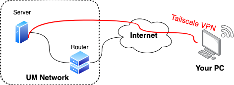

# Login to the server

Before we begin, let's understand some of the underlying theory.
- SSH: **Secure Shell Protocol** is a cryptographic network protocol for operating network services securely over an unsecured network. We will use SSH to communicate between your computer and the server. Once we establish the connection between you and the server, you can carried out any activities on the server, as if you are in front of the server. SSH is just a protocol, to initiate the connection, you need to use specific application, such as Terminal, Power Shell, VSCode, etc. Login tools are explained [here](#login-tools).
- Linux: Most of the server use Linux as the operating system. Specifically, our server uses Ubuntu distribution of Linux. Do familarize yourself with Linux and common command used for Linux. 
- Basic Network knowledge. Every computer and server in a network is assigned with unique IP.
   - IP: Example `20.212.19.176`.
   - Domain name: Example `www.um.edu.my`, which redirect to the IP. It is easier for you to remember domain name than IP.

### Network configuration

To ease everything up, we use Tailscale VPN to bypass the campus network's firewall. Typically, a campus network disallow certain ports to be access outside of the network. Therefore, the simplest way is to setup a VPN to bypass the firewall. A simple illustration is shown below.

:::note
You can access the server without VPN if you are using campus network. You just need to know the server's IP address. 
:::

So, how can you access the server outside of campus?

### Accessing the server outside of campus

The VPN server used is [Tailscale](https://tailscale.com/). It's simple to setup on both client and server. To access the server, you need to have an account on the server. Please follow the following guide to obtain access.

#### Signup a Tailscale account

First thing first, have an account with [Tailscale](https://tailscale.com/). Follow the guide to install the Tailscale client on your PC. Once you have complete installing client on your computer, please provide the following details to Dr Chuah.

:::info
**Things needed to access the server**
1. Email address registered on Tailscale.
2. Preferred username on server. Your username may only contain lowercase letters, underscore (`_`), and dash (`-`).
:::

#### Accept invite to server node on your Tailscale account

Once your account is created, you will be given an invite link to accept invitation to the network. Navigate to the link given, then the server node will appear in your account, named as `ubuntu22`. To understand how sharing works, Tailscale has a good explanation [here](https://tailscale.com/kb/1084/sharing/#how-sharing-works).

Server administrator will then create a new ACL rule in order for you to access to the server. Please wait 24 hours before contacting administrator.

#### Access to the server

Before that, ensure that you have connect to your Tailscale. You can use any login tools to access the server via `ssh <username>@<ip>` or `ssh <username>@ubuntu`. `ubuntu` is set to be the alias for the IP address of server. The IP should looks like `100.xxx.xxx.xxx`. This is a unique IP address that Tailscale allocate to the server. A good explanation can be found [here](https://tailscale.com/kb/1155/terminology-and-concepts/#tailscale-ip-address).
